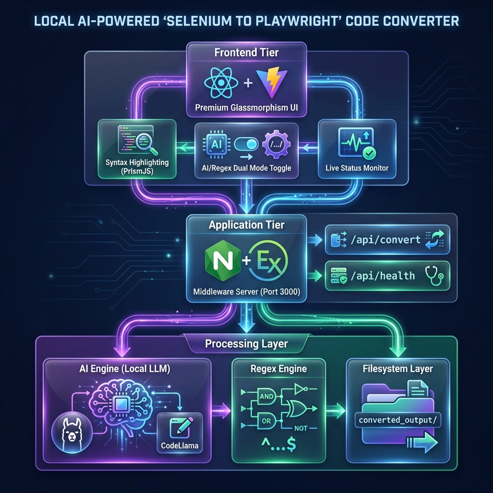

# Selenium to Playwright Converter

A premium web-based tool to convert TestNG Selenium Java tests into Playwright TypeScript/JavaScript using local AI.



## 🚀 Features

- **🤖 AI-Powered Conversion**: Uses Ollama with CodeLlama for intelligent, context-aware code transformation
- **📝 Regex Fallback**: Automatic fallback to pattern-based conversion if AI is unavailable
- **Instant Conversion**: Transform Selenium Java code to Playwright TypeScript with one click
- **Dual-Mode Operation**: Toggle between AI and Regex modes based on your needs
- **Real-time Status**: Live Ollama connection status and model availability
- **Premium UI**: Modern glassmorphism design with vibrant gradients
- **File Export**: Automatically saves converted files to `converted_output/` directory
- **Sample Code**: Built-in sample code to test the converter
- **Copy to Clipboard**: Easy copy functionality for converted code

## 🏗️ Architecture

This project follows the **B.L.A.S.T.** protocol with a 3-layer architecture:

```
├── architecture/          # Layer 1: SOPs and documentation
├── tools/                 # Layer 3: Conversion engine
│   ├── converter.js      # Main conversion logic
│   └── fileWriter.js     # File system operations
├── server/               # Backend API (Express)
│   └── index.js
├── client/               # Frontend UI (React + Vite)
│   └── src/
└── converted_output/     # Output directory for converted files
```

## 🛠️ Setup & Installation

### Prerequisites
- Node.js v24.13.0+
- npm 11.6.2+
- **Ollama** (optional, for AI-powered conversion)
  - Install: `brew install ollama` (macOS)
  - Start: `ollama serve`
  - Pull model: `ollama pull codellama`

### Installation

1. **Install Server Dependencies**
```bash
cd server
npm install
```

2. **Install Client Dependencies**
```bash
cd client
npm install
```

## 🎯 Running the Application

### ⚡ Option 1: Automated Launch (Recommended for macOS)
Use the provided launcher script to start everything with a single command. The script will:
- Check if Ollama is running
- Auto-install any missing dependencies
- Start the Backend and Frontend processes
- Automatically open the browser to `http://localhost:5173`

```bash
./run-app.sh
```
*To stop the application, simply press `Ctrl+C` in the terminal.*

---

### 🛠️ Option 2: Manual Start
If you prefer to run services individually:

**Terminal 1: Backend Server**
```bash
node server/index.js
```
*Server runs on `http://localhost:3000`*

**Terminal 2: Frontend Dev Server**
```bash
cd client
npm run dev
```
*Frontend runs on `http://localhost:5173`*

## 📖 Usage

1. Open `http://localhost:5173` in your browser
2. Paste your Selenium Java (TestNG) code in the left panel
3. Click "🚀 Convert to Playwright"
4. View the converted Playwright TypeScript code in the right panel
5. Files are automatically saved to `converted_output/` directory
6. Use "📋 Copy" to copy the converted code to clipboard

## 🎨 Conversion Mappings

| Selenium Java | Playwright TypeScript |
|--------------|----------------------|
| `WebDriver` | `Page` |
| `By.id("foo")` | `page.locator('#foo')` |
| `By.cssSelector(".btn")` | `page.locator('.btn')` |
| `.sendKeys("text")` | `.fill('text')` |
| `@Test` | `test('name', async ({ page }) => {})` |
| `@BeforeMethod` | `test.beforeEach(async ({ page }) => {})` |
| `Assert.assertEquals()` | `expect().toBe()` |

## 📂 Project Structure

```
SeleniumToPlaywrightConvertor/
├── BLAST.md              # B.L.A.S.T. protocol documentation
├── gemini.md             # Project constitution
├── task_plan.md          # Phase tracking
├── findings.md           # Research and discoveries
├── progress.md           # Activity log
├── architecture/         # SOPs
├── tools/                # Conversion engine
├── server/               # Express backend
├── client/               # React frontend
└── converted_output/     # Generated files
```

## 🔧 API Endpoints

### Health Check
```
GET /api/health
Response: { 
  "status": "ok", 
  "version": "2.0.0",
  "ollama": {
    "available": true,
    "hasCodeLlama": true,
    "models": ["codellama:latest", ...]
  }
}
```

### Convert Code
```
POST /api/convert
Body: { 
  "sourceCode": "string", 
  "fileName": "optional.spec.ts",
  "useOllama": true  // Toggle AI vs Regex mode
}
Response: { 
  "convertedCode": "string",
  "status": "success",
  "filePath": "string",
  "conversionTime": 13465,
  "usedOllama": true,
  "notes": ["Converted using CodeLlama AI", ...]
}
```

## 🎯 Current Status

✅ Phase 0: Initialization - Complete
✅ Phase 1: Blueprint - Complete
✅ Phase 2: Link - Complete
✅ Phase 3: Architect - Complete
✅ Phase 4: Stylize - Complete
✅ Phase 5: Trigger - Ready for deployment
✅ Phase 6: Ollama Integration - Complete (v2.0)

## 🚧 Future Enhancements

- Advanced AST-based parsing for complex Java patterns
- Support for Page Object Model conversion
- Batch file conversion
- Syntax highlighting in code editors
- Download as ZIP functionality
- Custom conversion rules configuration

## 📝 License

ISC

---

Built with ❤️ using the B.L.A.S.T. protocol
